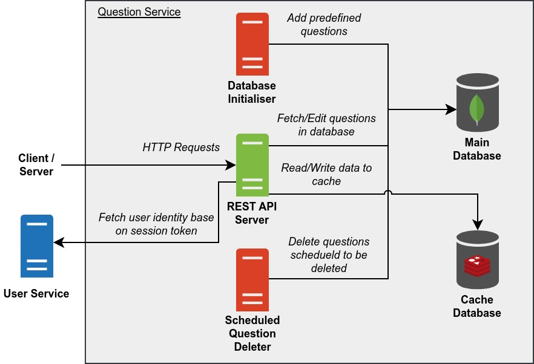

# PeerPrep Question Service

Manages questions.

Provides endpoints for CRUD operations with regards to question information.

## Table of Contents

- [Build Script](#build-script)
- [Architecture](#architecture)
- [Docker Images](#docker-images)
  - [API](#api)
  - [Database Initialiser](#database-initialiser)
  - [Scheduled Question Deleter](#scheduled-question-deleter)
- [Deployment](#deployment)
  - [Kubernetes Deployment](#kubernetes-deployment)
  - [Docker Compose Deployment](#docker-compose-deployment)
- [REST API](#rest-api)
  - [Response Format](#response-format)
  - [Retrieve All Questions](#retrieve-all-questions)
  - [Retrieve Question by ID](#retrieve-question-by-id)
  - [Retrieve Question by Params](#retrieve-question-by-params)
  - [Update Question](#update-question)
  - [Add Question](#add-question)
  - [Delete Question](#delete-question)
  - [Get Categories](#get-categories)
  - [Get Languages](#get-languages)

## Build Script

`build_images.sh` is a build script for building the Docker images and optionally pushing them to the container registry. To get more information about the script, run:

```
./build_images.sh -h
```

## Architecture



Legend:

- Start of arrow indicates request origin and end of arrow indicates request destination.
- `#505050` Dark grey items represents internal servers/containers.
- `#DA4026` Red items represents internal servers/containers that are temporary.
- `#7FBA42` Green items represents internal servers/containers that are exposed.
- `#2072B8` Blue items represents external servers/containers.

**REST API Server**

- Handles REST API requests.
- Can be scaled horizontally.
- Corresponds to the [API](#api) docker image.

**Database Initialiser**

- Populates the main database with predefined questions.
- Does nothing if the main database already contains one or more documents in the target collection.
- Shuts down once it is done initialising the main database.
- Corresponds to the [Database Initialiser](#database-initialiser) docker image.

**Scheduled Question Deleter**

- Periodically deletes all questions that are scheduled to be deleted.
- Should be scheduled to run periodically (e.g. once a day via a Cronjob).
- Corresponds to the [Scheduled Question Deleter](#scheduled-question-deleter) docker image.

**Main Database**

- Database for storing question information.

**Cache Database**

- Database for caching question information for fast retrieval.

## Docker Images

### API

**Name:** ghcr.io/cs3219-ay2324s1-g04/peerprep_question_service_api

**Description:** Runs the REST API.

**Environment Variables:**
- `MONGO_URI` - URI for connecting to the Mongo database (the main database).
- `REDIS_USERNAME` - Username for the Redis database (the caching database).
- `REDIS_PASSWORD` - Password for the Redis database (the caching database).
- `REDIS_HOST` - Address of the Redis database host (the caching database).
- `REDIS_PORT` - Port the Redis database (the caching database) is listening on.
- `REDIS_SHOULD_USE_TLS` - Should the Redis database connection be secured with TLS. Set to "true" to enable.
- `USER_SERVICE_HOST` - Address and port of the User Service host in the format `ADDRESS:PORT`.
- `API_PORT` - Port to listen on.
- `NODE_ENV` - Mode the app is running on ("development" or "production").

### Database Initialiser

**Name:** ghcr.io/cs3219-ay2324s1-g04/peerprep_question_service_database_initialiser

**Description:** Initialises the database by creating the predefined questions (if the database is empty).

**Environment Variables:** Same as [API](#api).

### Scheduled Question Deleter

**Name:** ghcr.io/cs3219-ay2324s1-g04/peerprep_question_service_scheduled_question_deleter

**Description:** Deletes questions from the database that are scheduled to be deleted. This image is intended to be run once every day.

**Environment Variables:** Same as [API](#api).

## Deployment

### Kubernetes Deployment

This is the main deployment method for production.

**Note:**

- The databases are hosted externally, not within the Kubernetes cluster.

**Prerequisite**

- Docker images must be pushed to the container registry and made public.
  - To push to the container registry (assuming one has the necessary permissions), run: `./build_images.sh -p`
  - To make the images public, change the visibility of the image on [GitHub](https://github.com/orgs/CS3219-AY2324S1-G04/packages).
- Kubernetes cluster must be setup as specified in the [main repository](https://github.com/CS3219-AY2324S1/ay2324s1-course-assessment-g04/blob/master/project/project.md#g04-project).
- User Service must be deployed within the Kubernetes cluster.

**Steps:**

1. Ensure the "peerprep" namespace has been created: `kubectl create namespace peerprep`
2. Navigate to the "kubernetes" directory: `cd kubernetes`
3. Deploy the Kubernetes objects: `./deploy.sh`
    - To delete the Kubernetes objects, run: `./delete.sh`

### Docker Compose Deployment

This is intended for development use only. It is meant to make developing other services easier.

**Note:**

- No horizontal auto scaling is provided.
- The database is created by Docker compose and data is not backed up.

**Prerequisite**

- Docker images must be built.
  - To build the images, run: `./build_images.sh`
- User Service must be deployed via Docker compose.

**Steps:**

1. Ensure that the "peerprep" network exist: `docker network create -d bridge peerprep`
2. Create the docker containers: `docker compose up`
    - To delete the docker containers, run: `docker compose down`

## REST API

### Response Format

**Response Format Successful**

```json
{
  "status": "successful",
  "data": {},
  "message": null
}
```

**Response Format Error**

```json
{
  "status": "error",
  "code": 404,
  "data": null,
  "message": "Error Message"
}
```

### Retrieve All Questions

> [GET] `/question-service/questions`

Retrieves all questions in the database.

**Parameters**

- `complexity` - The complexity of the question (Optional)
- `categories` - The categories of the question (Optional) - Can be multiple
- `languages` - The langSlug of the question (Optional)
- `limit` - The max number of questions in response (Optional)
- `offset` - The offset for the first question in response (Optional)

**Response**

- `200` - Success.
  - Returns questions as an Array of JSON objects
  - Each question has the following fields
    - id
    - title
    - complexity
    - description
  - Example Response Body
    ```json
    {
      "status": "success",
      "data": [
        {
          "id": "123",
          "title": "Example Question",
          "description": "Placeholder Description",
          "complexity": "Easy",
          "categories": ["Arrays"]
        },
        {
          "id": "234",
          "title": "Example Question 2",
          "description": "Placeholder Description",
          "complexity": "Easy",
          "categories": ["Arrays", "Algorithms"]
        }
      ],
      "message": null
    }
    ```
- `500` - Error
  - Unexpected error occurred on the server.

### Retrieve Question by ID

> [GET] `/question-service/questions/:id`

Retrieves a question by its ID.

**Response**

- `200` - Success.

  - Returns question with matching ID as JSON Object with the following fields:
    - id
    - title
    - description
    - complexity
    - categories
    - template
      - language
      - langSlug
      - code
  - Example Response Body
    ```json
    {
      "status": "success",
      "data": {
        "id": "123",
        "title": "Example Question",
        "description": "Placeholder Description",
        "complexity": "Easy",
        "categories": ["Arrays"],
        "template": [
          {
            "language": "C++",
            "langSlug": "cpp",
            "code": "class Solution {\npublic:\n    int lengthOfLongestSubstring(string s) {\n        \n    }\n};"
          }
        ]
      },
      "message": null
    }
    ```

- `404` - Error

  - Question ID not found in Database.

- `500` - Error
  - Unexpected error occurred on the server.

### Retrieve Question by Params

> [GET] `/question-service/question-matching/question`

Retrieves a random question by matching params.

**Parameters**

- `complexity` - The complexity of the question (Required)
- `categories` - The categories of the question (Optional) - Can be multiple
- `language` - The langSlug of the question (Required)

**Response**

- `200` - Success.

  - Returns question with matching filters as JSON Object with the following fields:
    - id
    - title
  - Example Response Body
    ```json
    {
      "status": "success",
      "data": {
        "id": "123",
        "title": "Example Question"
      },
      "message": null
    }
    ```

- `400` - Error

  - URL is missing complexity parameter.

- `500` - Error
  - Unexpected error occurred on the server.

### Update Question

> [PUT] `/question-service/questions/:id`

Updates a question in the database by ID.

The data for the new question is passed in the request body with the following fields:

- `title` - The title of the question
- `description` - The question description
- `complexity` - The difficulty level of the question
- `categories` - The different topics applicable to the question
- `template` - The template code for the question
  - `language` - The language of the template code
  - `langSlug` - The language slug of the template code
  - `code` - The template code

**Cookies**

- `session_token` - Session Token

**Response**

- `201` - Success.
  - Question is successfully added to the database.
    - Only users of user role `admin` or `maintainer` can update questions.
  - The `data` field in the response contains the newly added question.
  - Example Response Body
    ```json
    {
      "status": "success",
      "data": {
        "id": "123",
        "title": "Example Question",
        "description": "Placeholder Description",
        "complexity": "Easy",
        "categories": ["Arrays"],
        "template": [
          {
            "language": "C++",
            "langSlug": "cpp",
            "code": "class Solution {\npublic:\n    int lengthOfLongestSubstring(string s) {\n        \n    }\n};"
          }
        ]
      },
      "message": "Question updated successfully"
    }
    ```
- `403` - Error
  - The user does not have authorization to update questions in the database.
- `404` - Error
  - The question could not be found in the database.
- `500` - Error
  - Unexpected error occurred on the server.

### Add Question

> [POST] `/question-service/questions`

Adds a question to the database.

The data for the new question is passed in the request body with the following fields:

- `title` - The title of the question
- `description` - The question description
- `complexity` - The difficulty level of the question
- `categories` - The different topics applicable to the question
- `template` - The template code for the question
  - `language` - The language of the template code
  - `langSlug` - The language slug of the template code
  - `code` - The template code

**Cookies**

- `session_token` - Session Token

**Response**

- `201` - Success.
  - Question is successfully added to the database
    - Only users of user role `admin` or `maintainer` can add questions.
  - The `data` field in the response contains the newly added question
  - Example Response Body
    ```json
    {
      "status": "success",
      "data": {
        "id": "123",
        "title": "Example Question",
        "description": "Placeholder Description",
        "complexity": "Easy",
        "categories": ["Arrays"],
        "template": [
          {
            "language": "C++",
            "langSlug": "cpp",
            "code": "class Solution {\npublic:\n    int lengthOfLongestSubstring(string s) {\n        \n    }\n};"
          }
        ]
      },
      "message": "Question added successfully"
    }
    ```
- `403` - Error
  - The user does not have authorization to add questions to the database.
- `500` - Error
  - Unexpected error occurred on the server.

### Delete Question

> [DELETE] `/question-service/questions/:id`

Deletes a question in the database by ID.

**Cookies**

- `session_token` - Session Token

**Response**

- `201` - Success.
  - Question is successfully deleted from the database.
    - Only users of user role `admin` or `maintainer` can delete questions.
  - Example Response Body
    ```json
    {
      "status": "success",
      "data": null,
      "message": "Question deleted successfully"
    }
    ```
- `403` - Error
  - The user does not have authorization to delete questions from the database.
- `404` - Error
  - The question could not be found in the database.
- `500` - Error
  - Unexpected error occurred on the server.

### Get Categories

> [GET] `/question-service/categories`

Retrieves all unique categories in the database.

**Response**

- `200` - Success.
  - Returns categories as an Array of strings
  - Example Response Body
    ```json
    {
      "status": "success",
      "data": [
        "Algorithms",
        "Arrays",
        "Bit Manipulation",
        "Data Structure",
        "Data Structures",
        "Dynamic Programming",
        "Recursion",
        "Searching",
        "Sorting",
        "Strings"
      ],
      "message": null
    }
    ```
- `500` - Error
  - Unexpected error occurred on the server.

### Get Languages

> [GET] `/question-service/languages`

Retrieves all unique languages in the database.

**Response**

- `200` - Success.
  - Returns categories as an Array of objects with the fields `language` and `langSlug`
  - Example Response Body
    ```json
    {
      "status": "success",
      "data": [
        {
          "language": "C++",
          "langSlug": "cpp"
        },
        {
          "language": "Java",
          "langSlug": "java"
        },
        {
          "language": "Python",
          "langSlug": "python"
        }
      ],
      "message": null
    }
    ```
- `500` - Error
  - Unexpected error occurred on the server.
